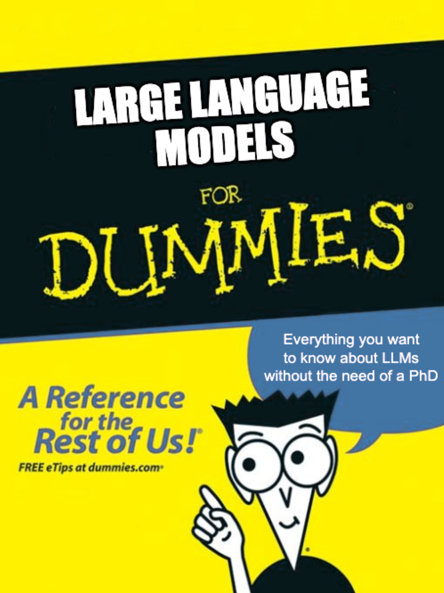
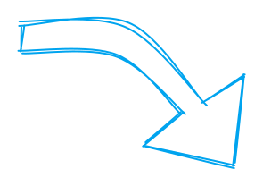

exclude: true

<!-- 
TO SHOW THE SLIDES:
==================
npm i -g backslide
cd <current_folder>
bs serve
-->

---
title: Understanding AI - Build your own enterprise ChatGPT with LangChain
class: animation-fade
layout: true

<!-- .twitter-handle[
  @sinedied
] -->

---

class: hide-handle, center, middle full, more-shadow
background-image: url(images/ai.jpg)

.title.center[
# .baseline[Understanding AI]
## .small[Build your own enterprise ChatGPT with LangChain]
]

.full-layer.who.text-right.small.middle.light-text.darkened[
  .ms.responsive[]
  |
  Yohan | Christopher | Julien
]

<!-- .full-layer.space-left.left.full-bottom.no-margin.conf-logo[
.w-15.responsive.logo-filter[]
] -->

<style>
.conf-logo { padding-bottom: .25em; }
</style>

---

exclude: true
class: middle, center, hide-handle
# .large.sketch[About me]

.table.row.middle[
.col-4.center[
  .w-70.responsive.avatar.tada.animated[]
]
.col-8.bit-larger.left.middle[

.responsive[
<object data="images/me.svg"></object>
]
]
]

---

class: center, middle, hide-handle
# Who are we?

.table.row.middle.center[
.col-2[]
.col-3.center[
  .w-70.responsive.avatar.bounceInLeft.animated[]

  **Yohan Lasorsa**<br>
  .fab.fa-linkedin[] .e[/yohanlasorsa]<br>
  .fab.fa-x-twitter[] .e[@sinedied]
]
.col-3.center[
  .w-70.responsive.avatar.bounceInUp.animated[]

  **Christopher Maneu**<br>
  .fab.fa-linkedin[] .e[/cmaneu]<br>
  .fab.fa-x-twitter[] .e[@cmaneu]
]
.col-3.center[
  .w-70.responsive.avatar.bounceInUp.animated[]

  **Julien Dubois**<br>
  .fab.fa-linkedin[] .e[/juliendubois]<br>
  .fab.fa-x-twitter[] .e[@juliendubois]
]
]

---

class: center, cover, hide-handle
background-image: url(./images/ai-landscape.jpg)

.full-layer.full-top.blur.with-padding[
# What are we talking about?
]

.full-layer.full-bottom.blur.small[
Extract from **The 2023 MAD (ML/AI/Data) Landscape**
by Matt Turck - https://mad.firstmark.com/
]
]

.here[ ]

<style>
.here {
  position: absolute;
  top: 150px;
  bottom: 340px;
  left: 370px;
  right: 570px;
}
</style>
<script>
rough('.here', { type: 'circle', color: '#f22', strokeWidth: 4, padding: 50, animationDuration: 2000 }, 1000);
</script>

???
- Tout le monde fait de l'IA ces temps-ci, mais de quoi on parle exactement?
- Focus sur les IA génératives dédiées au développement
- En particulier sur l'assistance au code

---

.col-6.float-left[
  .w-80.responsive[]
]
.col-6.float-left[
  <br><br>

  # LLM crash course
  - Training
  - Model types
  - Tokens
  - Limits
  - Embeddings
  - Prompt engineering
  - Agents
]

???
- Est-ce que vous êtes chauds pour faire un de maths?
  * ca tombe bien, moi non plus :D
- Pour bien savoir utiliser un outil, c'est mieux de comprendre comment il fonctionne
- On va prendre ici un point de vue de dev, car je n'ai pas de PhD en ML

---

class: center

# Training

.w-80.responsive[
  <object data="images/llm-training.svg"></object>
]

???
- pre-training: expensive $$$ (modèles fondamentaux)
- fine-tuning: cheap $ (modèles spécialisés)
- RLHF: long and complicated

---

class: 

# Model types

#### Pure text completion models

.pre[These models specialize in text completion .grey-text[*tasks such as question answering, machine translation and summarization.*]]
???
- LLMs do no think: they *just* complete text
--

#### Instruction-following models (aka chat models)

<span class="pre">&lt;|im_start|>system
You are a professional translator&lt;|im_end|>
&lt;|im_start|>user
How do I translate "hello" in French?&lt;|im_end|&gt;
<span class="grey-text">&lt;|im_start|>assistant
Bonjour&lt;|im_end|></span>
</span>

???
- Chat models are tuned to follow instructions, with the addition of special tokens

---

# Tokens

LLMs don't work with words, but with tokens.

.col-6.float-left.top.no-margin[
  .w-90.responsive.top[]
]
.col-6.float-left.top.no-margin[
  .w-90.responsive.top[]
]

???
- 1 token = ~4 characters
- https://platform.openai.com/tokenizer

---

# Limits

#### Context window
- Common limits: .em-text[**2-4K tokens**] (GPT-4: 8k or 32K)
- Context window limits .em-text[**input + output**]
???
- context training: O(n^2) complexity
- 4K tokens ~ 3K words ~ 6 pages
- 100K context windows => using tricks, with great loss of accuracy (attention)

---

# Limits

#### .circled[Context window]
- Common limits: .em-text[**2-4K tokens**] (GPT-4: 8k or 32K)
- Context window limits .em-text[**input + output**]

<script>
rough('.circled', { type: 'circle', color: '#f22', strokeWidth: 4, padding: 50, animationDuration: 2000 }, 500);
</script>
???
- context training: O(n^2) complexity
- 4K tokens ~ 3K words ~ 6 pages
- 100K context windows => using tricks, with great loss of accuracy (attention)
--

#### Statistical bias
- LLMs may reflect the biases of the training data
???
- Humans do both logical and stereotypical reasoning, LLMs do not have logic
???
- Who can give some code-related biases?
--

- Examples:
  * Optimized code?
  * Accessible code?
  * Best language to learn?

---

class: center
# Embeddings

.w-80.responsive[
  <object data="images/embedding.svg"></object>
]

???
- Embedding: vector representation of a piece of data, that captures the underlying structure and relationships between pieces of data
- Embeddings are used to build vector DBs
- This is how we "memorize" things (ie your data) in LLMs
- Ex: textes de loi

---

# Prompt engineering

#### Zero-shot

Generate output with no specific training or examples

.small[*Prompt:*]
.up[
```
Translate the following text in French: "Hello, world!"
```
]

.small[*Output:*]
.up[
```
"Bonjour, le monde !"
```
]

---

# Prompt engineering

#### Few-shot

Use in-context examples to condition the output

.small[*Prompt:*]
.up[
```
Bonjour Devoxx: french
Brian is in the kitchen: english
Danke schön: german
Den här koden är hemsk:
```
]

.small[*Output:*]
.up[
```
swedish
```
]

---

# Prompt engineering

#### Chain of thought

Simulate human-like reasoning and decision-making

.small[*Prompt:*
.up[
```
When I was 6 years old, my sister was twice my age. Now I'm 30. How old is my sister?
Let's think step by step.
```
]

*Output:*
.up[
```
Sure, let's break it down step by step.

1. When you were 6 years old, your sister was twice your age. This means your sister was 6 * 2 = 12 years old at that time.
2. The age difference between you and your sister is 12 - 6 = 6 years.
3. Now, you are 30 years old. To find out how old your sister is now, you need to add the age difference to your current age. So, 30 + 6 = 36.

Therefore, your sister is currently 36 years old.
```
]
]

---

# Prompt engineering

#### Chain of thought

Simulate human-like reasoning and decision-making

.small[*Prompt:*
.up[
```
When I was 6 years old, my sister was twice my age. Now I'm 30. How old is my sister?
*Let's think step by step.
```
]

*Output:*
.up[
```
Sure, let's break it down step by step.

1. When you were 6 years old, your sister was twice your age. This means your sister was 6 * 2 = 12 years old at that time.
2. The age difference between you and your sister is 12 - 6 = 6 years.
3. Now, you are 30 years old. To find out how old your sister is now, you need to add the age difference to your current age. So, 30 + 6 = 36.

Therefore, your sister is currently 36 years old.
```
]
]

???
- Without "Let's think step by step." => 24
- Allow to break down a problem into smaller, simpler steps

---

# Prompt engineering

#### Retrieval Augmented Generation

Use a vector DB to retrieve relevant information and add it to augment the context

.center[
.w-75.responsive[
<object data="images/rag.svg"></object>
]
]

---

# Agents

A program that perceives its environment, make decisions and takes actions to achieve goals autonomously.

.center[
.w-65.responsive[
  <object data="images/agent.svg"></object>
]
]

???
- ChatGPT nowaday with all its plugins is now an agent
---

# Frameworks
- 🦜️🔗 [LangChain](https://www.langchain.com/)
- [Semantic Kernel](https://github.com/microsoft/semantic-kernel)

---

# TODO

introduce OpenAI, API, Azure

---

exclude: true
class: middle, center, hide-handle, clist

.w-90.responsive[
<object data="images/thanks.svg"></object>
]

???
Feedback please!

---

exclude: true
class: middle, center, hide-handle, clist, big-text

# Thank you!

.arrow[
  .w-45.responsive[]
]

.row.table.middle[
.col-6.right.space-right[
<object data="images/qrcode.svg"></object>
]
.col-6.left[
.large[[bit.ly/ai-for-dev](https://bit.ly/ai-for-dev)]
]
]

@sinedied

<style>
.arrow {
  position: absolute;
  top: 24%;
  left: 40%;  
}
</style>

---

# References & going further

.full-layer.with-margins.right.space-right.noclick[
<br>
.w-35.responsive.circle[]
]

- [GitHub Copilot Video series](https://www.youtube.com/playlist?list=PLj6YeMhvp2S5_hvBl2SE-7YCHYlLQ0bPt)
- [How GPT models work](https://towardsdatascience.com/how-gpt-models-work-b5f4517d5b5)
- [Practical Deep Learning](https://course.fast.ai/)
- [OpenAI tokenizer](https://platform.openai.com/tokenizer)
- [Prompt Engineering Guide](https://www.promptingguide.ai)
- [GitHub Blog on Copilot](https://github.blog/?s=copilot)
- [Awesome LangChain](https://github.com/kyrolabs/awesome-langchain)
- [Responsible Generative AI training](https://learn.microsoft.com/training/modules/responsible-generative-ai/)
- [How to write better prompts for GitHub Copilot](https://github.blog/2023-06-20-how-to-write-better-prompts-for-github-copilot/)
- [Microsoft announces new Copilot Copyright Commitment for customers](https://blogs.microsoft.com/on-the-issues/2023/09/07/copilot-copyright-commitment-ai-legal-concerns/)
- [ChatGPT + Enterprise data with Azure OpenAI and Cognitive Search](https://github.com/Azure-Samples/azure-search-openai-javascript/)
- [About Samsung ChatGPT data leak](https://techcrunch.com/2023/05/02/samsung-bans-use-of-generative-ai-tools-like-chatgpt-after-april-internal-data-leak/)
