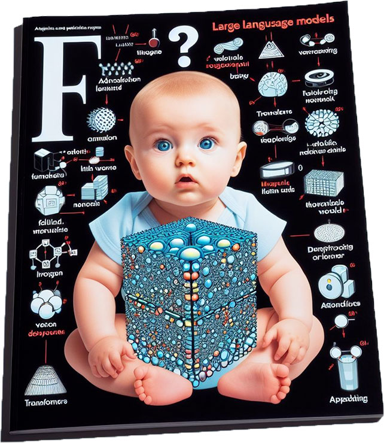
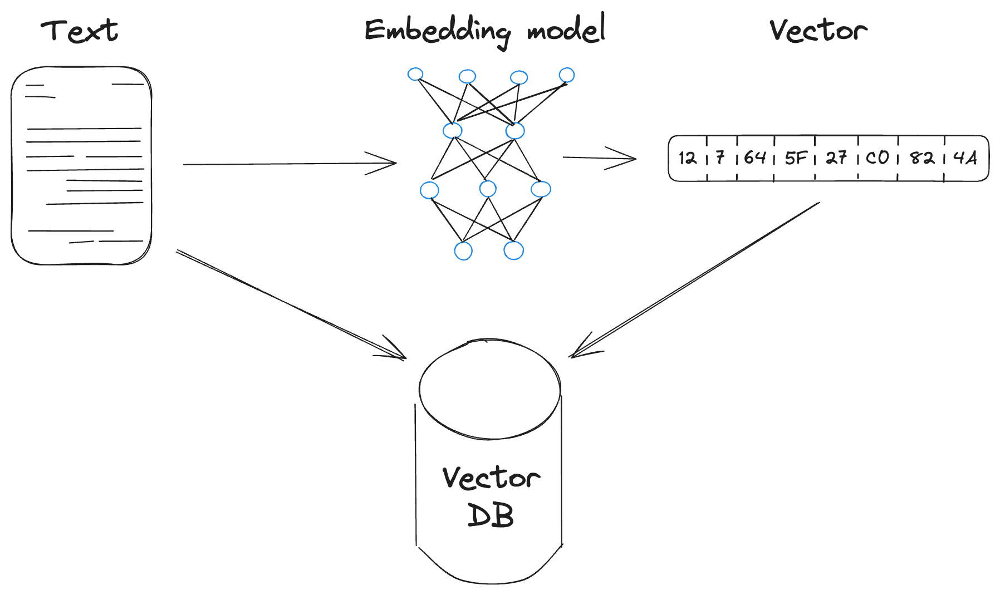

title: Understanding AI - Build your own enterprise ChatGPT with LangChain4j
class: animation-fade
layout: true

---

class: hide-handle, center, middle full, more-shadow
background-image: url(images/ai.jpg)

.title.center[
# .baseline[Understanding AI]
## .small[Build your own enterprise ChatGPT with LangChain4j]
]

.full-layer.who.text-right.small.middle.light-text.darkened[
  .ms.responsive[]
  |
  Sandra, Yohan, Julien
]

---

class: center, middle, hide-handle
# Who are we?

.table.row.middle.center[
.col-2[]
.col-3.center[
  .w-70.responsive.avatar.bounceInUp.animated[]

  **Sandra Ahlgrimm**<br>
  .fab.fa-linkedin[] .e[/sandraahlgrimm]<br>
  .fab.fa-x-twitter[] .e[@sKriemhild]
]
.col-3.center[
  .w-70.responsive.avatar.bounceInLeft.animated[]

  **Yohan Lasorsa**<br>
  .fab.fa-linkedin[] .e[/yohanlasorsa]<br>
  .fab.fa-x-twitter[] .e[@sinedied]
]
.col-3.center[
  .w-70.responsive.avatar.bounceInUp.animated[]

  **Julien Dubois**<br>
  .fab.fa-linkedin[] .e[/juliendubois]<br>
  .fab.fa-x-twitter[] .e[@juliendubois]
]
]

---

class: center

# What are we talking about?

.w-65.responsive[]

---

.col-6.float-left[
  .w-90.responsive[]
]
.col-6.float-left.space-left[
  <br><br>

  # LLM crash course
  - Model types
  - Tokens
  - Limits
  - Embeddings
  - Prompt engineering
]

<!--
# LLM crash course
- Training
- Model types
- Tokens
- Limits
- Embeddings
- Prompt engineering
- Agents
-->

???
- Who wants to do some maths? Great, me neither!
- To know who to use a tool, it's better to understand how it works
- We'll take the view of a dev, not a PhD in ML

---

exclude: true
class: center

# Training

.w-80.responsive[]

???
- pre-training: expensive $$$ (fundamental models)
- fine-tuning: cheap $ (specialized models)
- RLHF: long and complicated

---

class: 

# Model types

#### Pure text completion models

.pre[These models specialize in text completion .grey-text[*tasks such as question answering, machine translation and summarization.*]]
???
- LLMs do no think: they *just* complete text
--

#### Instruction-following models (aka chat models)

<span class="pre">&lt;|im_start|>system
You are a professional translator&lt;|im_end|>
&lt;|im_start|>user
How do I translate "hello" in French?&lt;|im_end|&gt;
<span class="grey-text">&lt;|im_start|>assistant
Bonjour&lt;|im_end|></span>
</span>

???
- Chat models are tuned to follow instructions, with the addition of special tokens

---

# Tokens

LLMs don't work with words, but with tokens.

.col-6.float-left.top.no-margin[
  .w-90.responsive.top[]
]
.col-6.float-left.top.no-margin[
  .w-90.responsive.top[]
]

???
- 1 token = ~4 characters
- https://platform.openai.com/tokenizer

---

# Limits

#### Context window
- Common limits: .em-text[**2-4K tokens**] (GPT-4: 8k or 32K)
- Context window limits .em-text[**input + output**]
- Some models differenciate input and output limits (GPT-4 Turbo: 128k in / 4k out)
???
- context training: O(n^2) complexity
- 4K tokens ~ 3K words ~ 6 pages
- 100K context windows => using tricks, with great loss of accuracy (attention)

---

# Limits

#### .circled[Context window]
- Common limits: .em-text[**2-4K tokens**] (GPT-4: 8k or 32K)
- Context window limits .em-text[**input + output**]
- Some models differenciate input and output limits (GPT-4 Turbo: 128k in / 4k out)

<script>
rough('.circled', { type: 'circle', color: '#f22', strokeWidth: 4, padding: 50, animationDuration: 2000 }, 500);
</script>
???
- context training: O(n^2) complexity
- 4K tokens ~ 3K words ~ 6 pages
- 100K context windows => using tricks, with great loss of accuracy (attention)
--

#### Statistical bias
- LLMs may reflect the biases of the training data (and context)
???
- Humans do both logical and stereotypical reasoning, LLMs do not have logic
- Who can give some biases examples?
  * Optimized code?
  * Accessible code?
  * Best language to learn?
--

- Examples?

---

class: center
# Embeddings

.w-80.responsive[]

???
- Embedding: vector representation of a piece of data, that captures the underlying structure and relationships between pieces of data
- Embeddings are used to build vector DBs
- This is how we "memorize" things (ie your data) in LLMs
- Example: law texts, medical texts, etc.

---

# Prompt engineering

#### Zero-shot

Generate output with no specific training or examples

.small[*Prompt:*]
.up[
```
Translate the following text in French: "Hello, world!"
```
]

.small[*Output:*]
.up[
```
"Bonjour, le monde !"
```
]

---

# Prompt engineering

#### Few-shot

Use in-context examples to condition the output

.small[*Prompt:*]
.up[
```
Bonjour le monde: french
Brian is in the kitchen: english
Dankeschön: german
Den här koden är hemsk:
```
]

.small[*Output:*]
.up[
```
swedish
```
]

---

# Prompt engineering

#### Chain of thought

Simulate human-like reasoning and decision-making

.small[*Prompt:*
.up[
```
When I was 6 years old, my sister was twice my age. Now I'm 30. How old is my sister?
Let's think step by step.
```
]

*Output:*
.up[
```
Sure, let's break it down step by step.

1. When you were 6 years old, your sister was twice your age. This means your sister was 6 * 2 = 12 years old at that time.
2. The age difference between you and your sister is 12 - 6 = 6 years.
3. Now, you are 30 years old. To find out how old your sister is now, you need to add the age difference to your current age. So, 30 + 6 = 36.

Therefore, your sister is currently 36 years old.
```
]
]

---

# Prompt engineering

#### Chain of thought

Simulate human-like reasoning and decision-making

.small[*Prompt:*
.up[
```
When I was 6 years old, my sister was twice my age. Now I'm 30. How old is my sister?
*Let's think step by step.
```
]

*Output:*
.up[
```
Sure, let's break it down step by step.

1. When you were 6 years old, your sister was twice your age. This means your sister was 6 * 2 = 12 years old at that time.
2. The age difference between you and your sister is 12 - 6 = 6 years.
3. Now, you are 30 years old. To find out how old your sister is now, you need to add the age difference to your current age. So, 30 + 6 = 36.

Therefore, your sister is currently 36 years old.
```
]
]

???
- Without "Let's think step by step." => 24
- Allow to break down a problem into smaller, simpler steps

---

# Prompt engineering

#### Retrieval Augmented Generation

Use a vector DB to retrieve relevant information and add it to augment the context

.center[
.w-75.responsive[]
]

---

exclude: true
# Agents

A program that perceives its environment, make decisions and takes actions to achieve goals autonomously.

.center[
.w-65.responsive[]
]

???
- ChatGPT nowaday with all its plugins is now an agent
---

# Frameworks
- [LangChain4j](https://docs.langchain4j.dev/)
- [Spring AI](https://spring.io/projects/spring-ai)
- [Semantic Kernel](https://github.com/microsoft/semantic-kernel)

They provide an abstraction layer on top of the LLM APIs, and
facilitate the assembly<br> (or "chain") of different components.

.small[
```java
import dev.langchain4j.model.input.Prompt;
import dev.langchain4j.model.input.PromptTemplate;

PromptTemplate promptTemplate = PromptTemplate.from("Translate '{{text}}' in {{language}}.");

Map<String, Object> variables = new HashMap<>();
variables.put("text", "hi");
variables.put("language", "French");

Prompt prompt = promptTemplate.apply(variables);
```
]

---

# OpenAI

OpenAI is an artificial intelligence research company.

- Known for their groundbreaking research on .primary-text[**generative models**], such as GPT-4, which can produce natural language, images, sounds, and code from a given prompt

- Offers a platform for developers to access and use its latest models and products, such as .primary-text[**ChatGPT, DALL·E 3, and GPT-4**]

<br>
.center[
.w-40.responsive[
  <object data="images/openai.png"></object>
]
]

---

exclude: true
# The OpenAI API

- Provides several [models](https://platform.openai.com/docs/models) with different capabilities and price ([doc](https://platform.openai.com/docs/api-reference) and [examples](https://platform.openai.com/examples)).
- Interact with the API through .primary-text[**HTTP requests**], or using language-specific .primary-text[**SDKs**] such as the official Python.
- You need to have an account and an .primary-text[**API key**] to use it.

.small[
```python
import os
import openai

openai.api_key = os.getenv("OPENAI_API_KEY")

response = openai.ChatCompletion.create(
  model="gpt-4",
  messages=[],
  temperature=0,
  max_tokens=256
)
```
]

---

.full-layer.right.stick-top.noclick.no-margin.bigup[
.w-35.responsive[]
]

# Azure

Microsoft Azure is a cloud computing platform that offers a wide range of services and solutions for developers, businesses, and organizations.

#### Azure is...

- .primary-text[**Open**] and .primary-text[**flexible**], allowing you to use the tools, languages, and frameworks of your choice.
- .primary-text[**Scalable**] and .primary-text[**reliable**], enabling you to handle any workload and demand with high availability and performance.
- .primary-text[**Secure**] and .primary-text[**compliant**], protecting your data and applications with advanced security features and certifications.

*There is a specific agreement between Azure and OpenAI, allowing you to use the OpenAI API on Azure. This service, called Azure OpenAI, is what we will be using in this workshop.*

<style>
.bigup { margin-top: -2.6em; }
</style>

---

class: center, middle, big-text
# The workshop

.bit-larger[👉 https://aka.ms/ws/openai-rag-quarkus]

---

# References & going further

.full-layer.with-margins.right.space-right.noclick[
<br>
.w-25.responsive.circle[]
]

- [How GPT models work](https://towardsdatascience.com/how-gpt-models-work-b5f4517d5b5)
- [Practical Deep Learning](https://course.fast.ai/)
- [OpenAI tokenizer](https://platform.openai.com/tokenizer)
- [Prompt Engineering Guide](https://www.promptingguide.ai)
- [Awesome LangChain](https://github.com/kyrolabs/awesome-langchain)
- [Responsible Generative AI training](https://learn.microsoft.com/training/modules/responsible-generative-ai/)
- [Generative AI for Beginners Free Course](https://github.com/microsoft/generative-ai-for-beginners)
- [Microsoft announces new Copilot Copyright Commitment for customers](https://blogs.microsoft.com/on-the-issues/2023/09/07/copilot-copyright-commitment-ai-legal-concerns/)
- **ChatGPT + Enterprise data with Azure OpenAI and AI Search sample**:
  * [JavaScript](https://github.com/Azure-Samples/azure-search-openai-javascript/)
  * [Python version](https://github.com/Azure-Samples/azure-search-openai-demo/)
  * [Java version](https://github.com/Azure-Samples/azure-search-openai-demo-java)
  * [C# version](https://github.com/Azure-Samples/azure-search-openai-demo-csharp)
