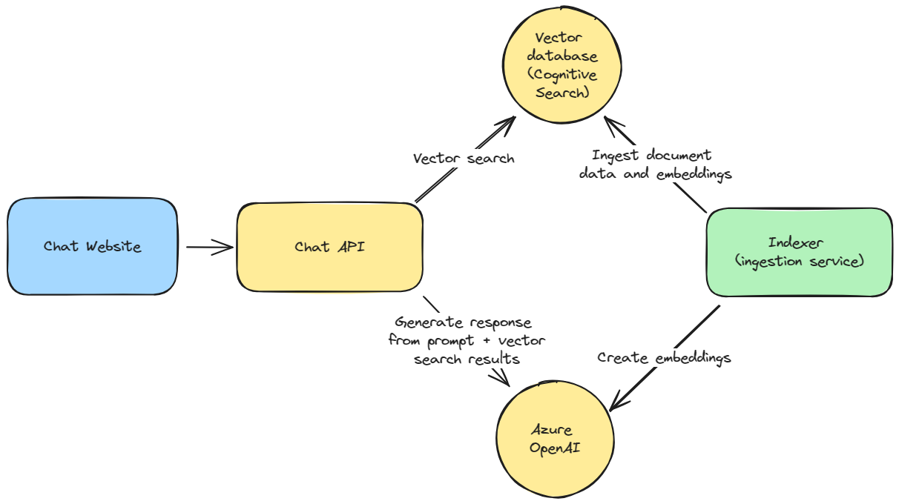
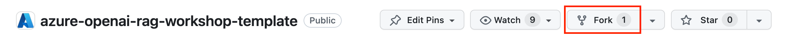
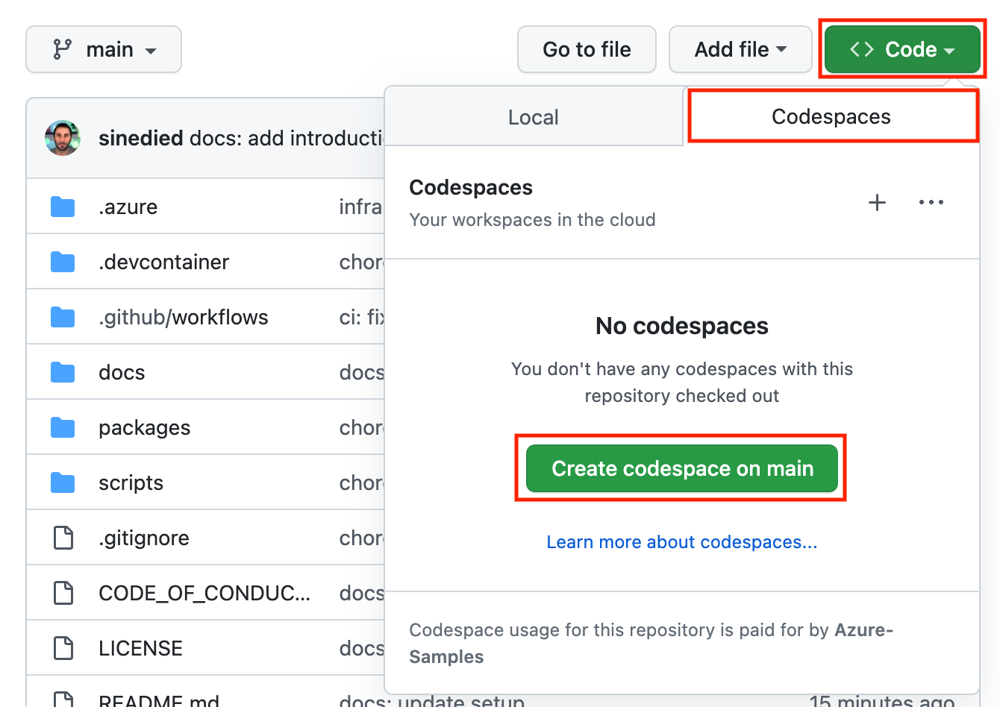
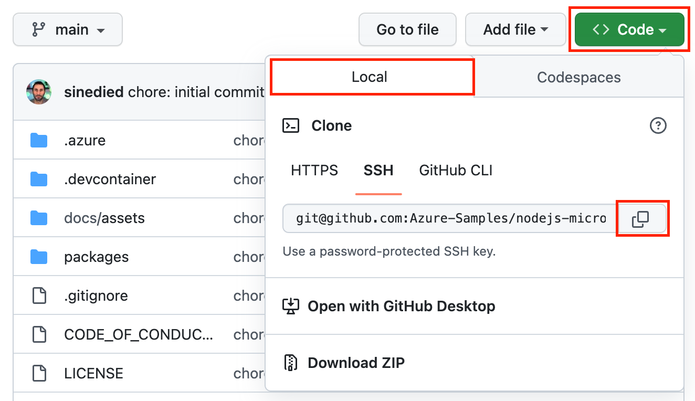
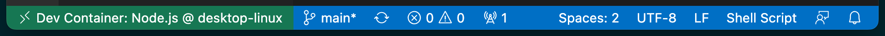
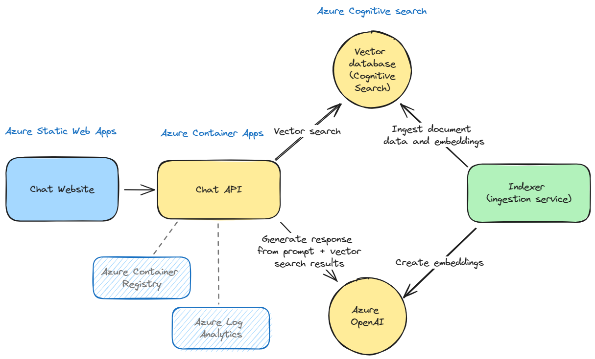
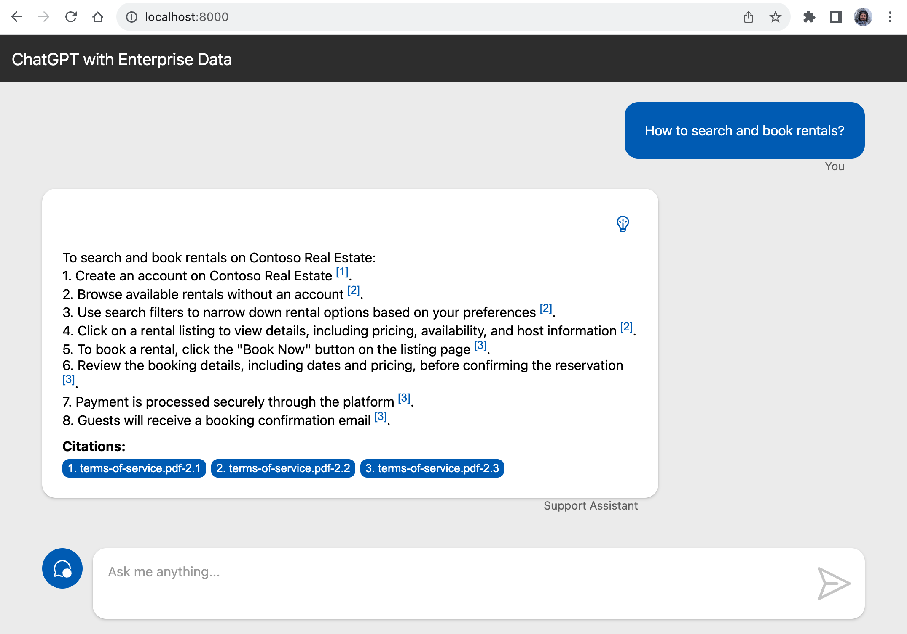
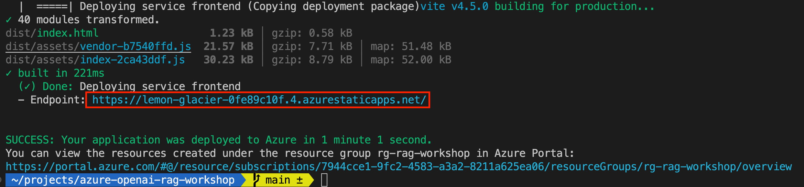
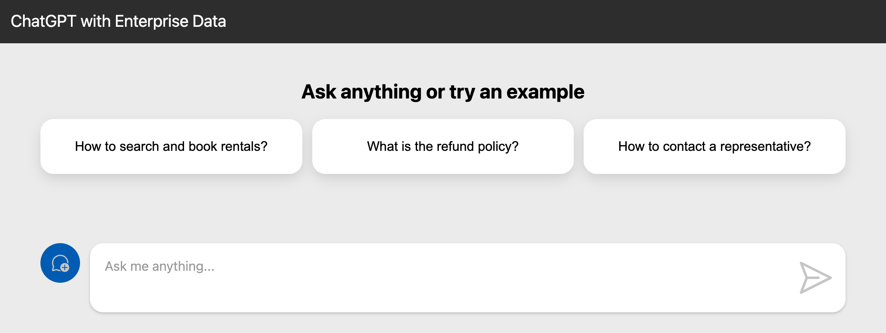

# Create your own ChatGPT with Retrieval-Augmented-Generation

In this workshop, we'll explore the fundamentals of custom ChatGPT experiences based on a corpus of documents. We will create a vector database and fill-in with data from PDF documents, and then build a chat website and API to be able to ask questions about information contained in these documents. 

## You'll learn how to...

- Create a knowledge base using a vector database.
- Ingest documents in a vector database.
- Create a Web API with [Fastify](https://www.fastify.io).
- Use [OpenAI](https://openai.com) models and [LangChain](https://js.langchain.com/docs/) to generate answers based on a prompt.
- Query a vector database and augment a prompt to generate responses.
- Connect your Web API to a ChatGPT-like website.
- Deploy your application on Azure.

## Prerequisites

| | |
|----------------------|------------------------------------------------------|
| GitHub account       | [Get a free GitHub account](https://github.com/join) |
| Azure account        | [Get a free Azure account](https://azure.microsoft.com/free) |
| Access to Azure OpenAI API | [Request access to Azure OpenAI](https://aka.ms/oaiapply) |
| A Web browser        | [Get Microsoft Edge](https://www.microsoft.com/edge) |
| JavaScript knowledge | [JavaScript tutorial on MDN documentation](https://developer.mozilla.org/docs/Web/JavaScript)<br>[JavaScript for Beginners on YouTube](https://www.youtube.com/playlist?list=PLlrxD0HtieHhW0NCG7M536uHGOtJ95Ut2) |

We'll use [GitHub Codespaces](https://github.com/features/codespaces) to have an instant dev environment already prepared for this workshop.

If you prefer to work locally, we'll also provide instructions to setup a local dev environment using either VS Code with a [dev container](https://aka.ms/vscode/ext/devcontainer) or a manual install of the needed tools.

<div class="info" data-title="note">

> Your Azure account must have `Microsoft.Authorization/roleAssignments/write` permissions, such as [Role Based Access Control Administrator](https://learn.microsoft.com/azure/role-based-access-control/built-in-roles#role-based-access-control-administrator-preview), [User Access Administrator](https://learn.microsoft.com/azure/role-based-access-control/built-in-roles#user-access-administrator), or [Owner](https://learn.microsoft.com/azure/role-based-access-control/built-in-roles#owner). Your account also needs `Microsoft.Resources/deployments/write` permissions at a subscription level to allow deployment of Azure resources.
>
> If you have your own personal Azure subscription, you should be good to go. If you're using an Azure subscription provided by your company, you may need to contact your IT department to ensure you have the necessary permissions.

</div>

---

## Introduction

Organizations of all sizes have amassed a plethora of documents over time. While generative AI, such as ChatGPT, can provide answers about general knowledge and historical events with reasonable accuracy, they can also be tailored to answer questions based on a company's internal documents.

<div class="info" data-title="note">

> **Accuracy in Generative AI** 
> Large Language Models (LLMs), like the ones powering ChatGPT, aren't designed for high-precision answers. They may produce "hallucinations", offering responses that seem authoritative but are actually incorrect. It's crucial to **inform users that the responses are AI-generated**. In this workshop, we'll explore how to generate answers that link to their information sources — this is what we call *grounding* — enabling users to verify the accuracy of the AI's responses.

</div>

In this workshop, we'll guide you through building a chat application that generates responses based on your documents and deploy it to Azure. We'll touch on many different topics, but we'll take it one step at a time.

### Application architecture

Below is the architecture of the application we're going to build:



Our application consists of four main components:

1. **Vector Database and Ingestion Service**: The vector database stores mathematical representations of our documents, known as _embeddings_. These are used by the Chat API to find documents relevant to a user's question. An ingestion service is required to feed data from your documents into this vector database.

2. **Chat API**: This API enables a client application to send chat messages and receive answers generated from the documents in the vector database.

3. **Chat Website**: This site offers a ChatGPT-like interface for users to ask questions and receive answers about the ingested documents.

4. **OpenAI Model Deployment**: We will use the `gpt-3.5-turbo` model, hosted on Azure, for this workshop. The code can also be adapted to work with OpenAI's APIs with minimal changes.

### What is Retrievial-Augmented Generation?

Retrieval-Augmented generation (RAG) is a powerful technique that combines the strengths of two different approaches in natural language processing: retrieval-based methods and generative models. This hybrid approach allows for the generation of responses that are both contextually relevant and rich in content. Let's break down how this works in the context of creating a custom ChatGPT-like model.

At its core, RAG involves two main components:

- **Retriever**: Think "_like a search engine_", finding relevant information from a database. The retriever usually searches in a vector database. It could also - for some use cases - search on application dabases, APIs and other sources of information. In this workshop, we will implement this login in the _Chat API_.

- **Generator**: Acts like a writer, taking the prompt and information retrieved to craft a response. In this workshop, OpenAI `gpt-3.5-turbo` will be our generator.


The RAG process involves the following steps:

1. **Embedding Computation**: Converts a user's prompt into an embedding for similarity comparisons.

2. **Document Retrieval**: Finds the most relevant documents using the prompt's embedding. This is where systems like Azure AI Search come into play, allowing for efficient vector similarity searches.

3. **Contextual Augmentation**: Enhances the user prompt with information from retrieved documents. This step is crucial as it provides additional context and information to the generator.

4. **Response Generation**: Use the model to generate a response using the augmented prompt. The model uses the additional context provided by the retrieved documents to produce a more informed and accurate output.


---

## Preparation

Before diving into development, let's set up your project environment. This includes:

- Creating a new project on GitHub based on a template
- Using a prepared dev container environment on either [GitHub Codespaces](https://github.com/features/codespaces) or [VS Code with Dev Containers extension](https://aka.ms/vscode/ext/devcontainer) (or a manual install of the needed tools)

### Creating your project

1. Open [this GitHub repository](https://github.com/Azure-Samples/azure-openai-rag-workshop)
2. Click the **Fork** button and click on **Create fork** to create a copy of the project in your own GitHub account.



Once the fork is created, select the **Code** button, then the **Codespaces** tab and click on **Create Codespaces on main**.



This will initialize a development container with all necessary tools pre-installed. Once it's ready, you have everything you need to start coding. Wait a few minutes after the UI is loaded to ensure everything is ready, as some tasks will be triggered after everything is fully loaded, such as the installation of the npm packages with `npm install`.

<div class="info" data-title="note">

> GitHub Codespaces provides up to 60 hours of free usage monthly for all GitHub users. You can check out [GitHub's pricing details](https://github.com/features/codespaces) for more information.

</div>

#### [optional] Local Development with the dev container

If you prefer working on your local machine, you can also run the dev container on your machine. If you're fine with using Codespaces, you can skip directly to the next section.


1. Ensure you have [Docker](https://www.docker.com/products/docker-desktop), [VS Code](https://code.visualstudio.com/), and the [Dev Containers extension](https://aka.ms/vscode/ext/devcontainer) installed.

<div class="tip" data-title="tip">

> You can learn more about Dev Containers in [this video series](https://learn.microsoft.com/shows/beginners-series-to-dev-containers/). You can also [check the website](https://containers.dev) and [the specification](https://github.com/devcontainers/spec).

</div>

2. In GitHub website, select the **Code** button, then the **Local** tab and copy your repository url.


3. Clone your forked repository and then open the folder in VS Code:

   ```bash
   git clone <your_repository_url>
   ```

3. In VS Code, use `Ctrl+Shift+P` (or `Command+Shift+P` on macOS) to open the **command palette** and type **Reopen in Container**.

   

   *Alt text: Screenshot of VS Code showing the "Reopen in Container" command.*

The first time it will take some time to download and setup the container image, meanwhile you can go ahead and read the next sections.

Once the container is ready, you will see "Dev Container: OpenAI Workshop" in the bottom left corner of VSCode:




#### [optional] Working locally without the dev container

If you want to work locally without using a dev container, you need to clone the project and install the following tools:

| | |
|---------------|--------------------------------|
| Git           | [Get Git](https://git-scm.com) |
| Docker v20+   | [Get Docker](https://docs.docker.com/get-docker) |
| Node.js v20+  | [Get Node.js](https://nodejs.org) |
| Azure CLI     | [Get Azure CLI](https://learn.microsoft.com/cli/azure/install-azure-cli#install) |
| GitHub CLI    | [Get GitHub CLI](https://cli.github.com/manual/installation) |
| Azure Developer CLI | [Get Azure Developer CLI](https://learn.microsoft.com/azure/developer/azure-developer-cli/install-azd) |
| GitHub CLI    | [Get GitHub CLI](https://cli.github.com/manual/installation) |
| Bash v3+      | [Get bash](https://www.gnu.org/software/bash/) (Windows users can use **Git bash** that comes with Git) |
| A code editor | [Get VS Code](https://aka.ms/get-vscode) |

You can test your setup by opening a terminal and typing:

```sh
git --version
docker --version
node --version
az --version
gh --version
azd version
gh --version
bash --version
```


---

## Additional setup

To complete the template setup, please run the following command in a terminal, at the root of the project:

```bash
./scripts/setup-template.sh aisearch
```


---

## Overview of the project

The project template you've forked is a monorepo, which means it's a single repository that houses multiple projects. Here's how it's organized, focusing on the key files and directories:

```sh
.devcontainer/  # Configuration for the development container
data/           # Sample PDFs to serve as custom data
infra/          # Templates and scripts for Azure infrastructure
scripts/        # Utility scripts for document ingestion
src/            # Source code for the application's services
|- backend/     # The Chat API
|- frontend/    # The Chat website
|- ingestion/   # Service for document ingestion
package.json    # Configuration for NPM workspace
```

We're using Node.js for our APIs and website, and have set up an [NPM workspace](https://docs.npmjs.com/cli/using-npm/workspaces) to manage dependencies across all projects from a single place. Running `npm install` at the root installs dependencies for all projects, simplifying monorepo management.

For instance, `npm run <script_name> --workspaces` executes a script across all projects, while `npm run <script_name> --workspace=backend` targets just the backend.

Otherwise, you can use your regular `npm` commands in any project folder and it will work as usual.

### About the services

We generated the base code of our differents services with the respective CLI or generator of the frameworks we'll be using, and we've pre-written several service components so you can jump straight into the most interesting parts.

### The Chat API specification

Creating a chat-like experience requires two main components: a user interface and a service API. The [ChatBootAI OpenAPI specification](https://editor.swagger.io/?url=https://raw.githubusercontent.com/ChatBootAI/chatbootai-openapi/main/openapi/openapi-chatbootai.yml) standardizes their interactions. This standardization allows for the development of different client applications (like mobile apps) that can interact seamlessly with chat services written in various programming languages.

#### The Chat request

A chat request is sent in JSON format, and must contain at least the user's message. Other optional parameters include a flag indicating if the response should be streamed, context-specific options that can tailor the chat service's behavior and a session state object that can be used to maintain state between requests.

```json
{
  "messages": [
    {
      "content": "Can I do some Scuba diving?",
      "role": "user"
    }
  ],
  "stream": false,
  "context": { ... },
  "session_state": null
}
```


#### The chat response

The chat service responds with a JSON object representing the generated response. The answer is located under the message's `content` property.

```json
{
  "choices": [
    {
      "index": 0,
      "message": {
        "content": "There is no information available about Scuba diving in the provided sources.",
        "role": "assistant",
        "context": { ... }
      }
    }
  ],
}
```

You can learn more about the [ChatBootAI OpenAPI specification here](https://editor.swagger.io/?url=https://raw.githubusercontent.com/ChatBootAI/chatbootai-openapi/main/openapi/openapi-chatbootai.yml) and on [the GitHub repo](https://github.com/ChatBootAI/chatbootai-openapi).

<div class="info" data-title="note">

> If streaming is enabled, the response will be a stream of JSON objects, each representing a chunk of the response. This format allows for a dynamic and real-time messaging experience, as each chunk can be sent and rendered as soon as it's ready. In that case, the response format follows the [Newline Delimited JSON (NDJSON)](https://github.com/ndjson/ndjson-spec) specification, which is a convenient way of sending structured data that may be processed one record at a time.

</div>


---

## Azure setup

[Azure](https://azure.microsoft.com) is Microsoft's comprehensive cloud platform, offering a vast array of services to build, deploy, and manage applications across a global network of Microsoft-managed data centers. In this workshop, we'll leverage several Azure services to run our chat application.

### Getting Started with Azure

<div data-hidden="$$azpass$$">

To complete this workshop, you'll need an Azure account. If you don't already have one, you can sign up for a free account, which includes Azure credits, on the [Azure website](https://azure.microsoft.com/free/).

<div class="important" data-title="important">

> If you already have an Azure account from your company, **DO NOT** use it for this workshop as it may have restrictions that will prevent you from completing the workshop.
> You'll need to create a new account to redeem the Azure Pass.

</div>

</div>

<div data-visible="$$azpass$$">

To complete this workshop, you'll need an Azure account. As you're attending this workshop in-person, you can create one and obtain a free Azure Pass credit by using this link: [redeem your Azure Pass](https://azcheck.in/$$azpass$$).

> If you're **not** attending this workshop in-person, you can sign up for a free account, which includes Azure credits, on the [Azure website](https://azure.microsoft.com/free/).

</div>

### Configure your project and deploy infrastructure

Before we dive into the details, let's set up the Azure resources needed for this workshop. This initial setup may take a few minutes, so it's best to start now. We'll be using the [Azure Developer CLI](https://learn.microsoft.com/azure/developer/azure-developer-cli/), a tool designed to streamline the creation and management of Azure resources.

#### Log in to Azure

Begin by logging into your Azure subscription with the following command:

```sh
azd auth login --use-device-code
```

This command will provide you a *device code* to enter in a browser window. Follow the prompts until you're notified of a successful login.

#### Create a New Environment

Next, set up a new environment. The Azure Developer CLI uses environments to manage settings and resources:

```sh
azd env new openai-rag-workshop
```

<div data-visible="$$proxy$$">

As we have deployed an Open AI service for you, run this command to set the OpenAI URL we want to use:

```
azd env set AZURE_OPENAI_URL $$proxy$$
```

</div>

#### Deploy Azure Infrastructure

Now it's time to deploy the Azure infrastructure for the workshop. Execute the following command:

```sh
azd provision
```

You will be prompted to select an Azure subscription and a deployment region. It's generally best to choose a region closest to your user base for optimal performance, but for this workshop, choose `West Europe` or `East US 2` depending of which one is the closest to you.

<div class="info" data-title="Note">

> Some Azure services, such as AI Vector Search and Azure Open AI, have [limited regional availability](https://azure.microsoft.com/explore/global-infrastructure/products-by-region/?products=cognitive-services,search&regions=non-regional,europe-north,europe-west,france-central,france-south,us-central,us-east,us-east-2,us-north-central,us-south-central,us-west-central,us-west,us-west-2,us-west-3,asia-pacific-east,asia-pacific-southeast). If you're unsure which region to select, _West US 2_ and _West Europe_ are typically safe choices as they support a wide range of services.

</div>

After your infrastructure is deployed, run this command:

```bash
azd env get-values > .env

# Remove all double quotes, as they are not supported by Docker
perl -pi -e 's/\"//g' .env
```

This will create a `.env` file at the root of your repository, containing the environment variables needed to connect to your Azure services.

As this file may sometimes contains application secrets, it's a best practice to keep it safe and not commit it to your repository. We already added it to the `.gitignore` file, so you don't have to worry about it.

### Deploying the ingestion service

Once your infrastructure is deployed, you can immediately deploy the ingestion service so we can some gain time later. We'll explore the ingestion service in more detail later in the workshop.

```sh
azd deploy ingestion
```

### Introducing Azure services

In our journey to deploy the chat application, we'll be utilizing a suite of Azure services, each playing a crucial role in the application's architecture and performance.



Here's a brief overview of the Azure services we'll use:

| Service | Purpose |
| ------- | ------- |
| [Azure Container Apps](https://learn.microsoft.com/azure/container-apps/) | Hosts our containerized applications with features like auto-scaling and load balancing. |
| [Azure Static Web Apps](https://learn.microsoft.com/azure/static-web-apps/) | Serves our static Web chat with integrated APIs, authentication, and global distribution. |
| [Azure Container Registry](https://learn.microsoft.com/azure/container-registry/) | Stores our Docker container images in a managed, private registry. |
| [Azure Log Analytics](https://learn.microsoft.com/azure/log-analytics/) | Collects and analyzes telemetry and logs for insights into application performance and diagnostics. |
| [Azure Monitor](https://learn.microsoft.com/azure/azure-monitor/) | Provides comprehensive monitoring of our applications, infrastructure, and network. |

While Azure Log Analytics and Azure Monitor aren't depicted in the initial diagram, they're integral to our application's observability, allowing us to troubleshoot and ensure our application is running optimally.

#### About Azure Container Apps

[Azure Container Apps](https://learn.microsoft.com/azure/container-apps/overview) is our primary service for running the chat application. It's a serverless container service that abstracts away the underlying infrastructure, enabling us to focus on writing and deploying code.

Key features of Azure Container Apps include:

- **Serverless Nature**: Automatically scales up or down, even to zero, to match demand.
- **Simplified Management**: No need to manage Kubernetes clusters or nodes.
- **Integrated Environment**: Built-in support for Dapr and KEDA, facilitating microservices development and event-driven scaling.
- **Traffic Splitting**: Facilitates A/B testing and phased rollouts with traffic routing between different app revisions.


Azure Container Apps sits in the sweet spot between PaaS and FaaS, offering the flexibility of a PaaS with the scaling characteristics of a FaaS.

Container Apps is built on top of [Azure Kubernetes Service](https://learn.microsoft.com/azure/aks/), including a deep integration with KEDA (event-driven auto scaling for Kubernetes), Dapr (distributed application runtime) and Envoy (a service proxy designed for cloud-native applications).
The underlying complexity is completely abstracted for you.
So, no need to configure your Kubernetes service, ingress, deployment, volume manifests... You get a very simple API and user interface to configure the desired configuration for your containerized application.
This simplification means also less control, hence the difference with AKS.


Azure Container Apps introduces the following concepts:
- *Environment*: this is a secure boundary around a group of Container Apps.
They are deployed in the same virtual network, these apps can easily intercommunicate easily with each other and they write logs to the same Log Analytics workspace. An environment can be compared with a Kubernetes namespace.

- *Container App*: this is a group of containers (pod) that is deployed and scale together. They share the same disk space and network.

- *Revision*: this is an immutable snapshot of a Container App.
New revisions are automatically created and are valuable for HTTP traffic redirection strategies, such as A/B testing.

### Creating the infrastructure

Now that we know what we'll be using, let's create the infrastructure we'll need for this workshop.

To set up our application, we can choose from various tools like the Azure CLI, Azure Portal, ARM templates, or even third-party tools like Terraform. All these tools interact with Azure's backbone, the [Azure Resource Manager (ARM) API](https://docs.microsoft.com/azure/azure-resource-manager/management/overview).


Any resource you create in Azure is part of a **resource group**. A resource group is a logical container that holds related resources for an Azure solution, just like a folder.

When we ran `azd provision`, it created a resource group named `rg-openai-rag-workshop` and deployed all necessary infrastructure components using Azure CLI and Infrastructure as Code (IaC) templates.

### Introducing Infrastructure as Code

Infrastructure as Code (IaC) is a practice that enables the management of infrastructure using configuration files. It ensures that our infrastructure deployment is repeatable and consistent, much like our application code. This code is committed to your project repository so you can use it to create, update, and delete your infrastructure as part of your CI/CD pipeline or locally.


There are many existing tools to manage your infrastructure as code, such as Terraform, Pulumi, or [Azure Resource Manager (ARM) templates](https://learn.microsoft.com/azure/azure-resource-manager/templates/overview). ARM templates are JSON files that allows you to define and configure Azure resources.

For this workshop, we're using [Bicep](https://learn.microsoft.com/azure/azure-resource-manager/bicep/overview?tabs=bicep), a language that simplifies the authoring of ARM templates.

#### What's Bicep?

Bicep is a Domain Specific Language (DSL) for deploying Azure resources declaratively. It's designed for clarity and simplicity, with a focus on ease of use and code reusability. It's a transparent abstraction over ARM templates, which means anything that can be done in an ARM Template can be done in Bicep.

Here's an example of a Bicep file that creates a Log Analytics workspace:

```bicep
resource logsWorkspace 'Microsoft.OperationalInsights/workspaces@2021-06-01' = {
  name: 'my-awesome-logs'
  location: 'westeurope'
  tags: {
    environment: 'production'
  }
  properties: {
    retentionInDays: 30
  }
}
```

A resource is made of differents parts. First, you have the `resource` keyword, followed by a symbolic name of the resource that you can use to reference that resource in other parts of the template. Next to it is a string with the resource type you want to create and API version.

<div class="info" data-title="note">

> The API version is important, as it defines the version of the template used for a resource type. Different API versions can have different properties or options, and may introduce breaking changes. By specifying the API version, you ensure that your template will work regardless of the product updates, making your infrastructure more resilient over time.

</div>

Inside the resource, you then specify the name of the resource, its location, and its properties. You can also add tags to your resources, which are key/value pairs that you can use to categorize and filter your resources.

Bicep templates can be modular, allowing for the reuse of code across different parts of your infrastructure. They can also accept parameters, making your infrastructure dynamically adaptable to different environments or conditions.

Explore the `./infra` directory to see how the Bicep files are structured for this workshop. The `main.bicep` file is the entry point, orchestrating various modules found in the `./infra/core` folder.

Bicep streamlines the template creation process, and you can get started with existing templates from the [Azure Quickstart Templates](https://github.com/Azure/azure-quickstart-templates/tree/master/quickstarts), use the [Bicep VS Code extension](https://marketplace.visualstudio.com/items?itemName=ms-azuretools.vscode-bicep) for assistance, or try out the [Bicep playground](https://aka.ms/bicepdemo) for converting between ARM and Bicep formats.


---


## The vector database

We'll start by creating a vector database. Vectors are arrays of numbers that represent the features or characteristics of the data. For example, an image can be converted into a vector of pixels, or a word can be converted into a vector of semantic meaning. A vector database can perform fast and accurate searches based on the similarity or distance between the vectors, rather than exact matches. This enables applications such as image recognition, natural language processing, recommendation systems, and more.

### Ingestion and retrieval

In our use-case, text will be extracted out of PDF files, and this text will be *tokenized*. Tokenization is the process of splitting our text into different tokens, which will be short portions of text. Those tokens will then be converted into a *vector* and added to the database. The vector database is then able to search for similar vectors based on the distance between them.

That's how our system will be able to find the most relevant data, coming from the original PDF files.

This will be used in the first component (the *Retriever*) of the Retrieval Augmented Generation (RAG) pattern that we will use to build our custom ChatGPT.

### About vector databases

There are many available vector databases, and a good list can be found in the supported Vector stores list from the LangChain project: [https://js.langchain.com/docs/integrations/vectorstores/](https://js.langchain.com/docs/integrations/vectorstores/).

Some of the most popular ones are:

- [MemoryVectorStore](https://js.langchain.com/docs/integrations/vectorstores/memory) which is an in-memory vector store, which is great for testing and development, but not for production.
- [Qdrant](https://qdrant.tech/)
- [pgvector](https://github.com/pgvector/pgvector)
- [Redis](https://redis.io)

### Introducing Azure AI Search


[Azure AI Search](https://azure.microsoft.com/products/ai-services/cognitive-search/) can be used as a vector database that can store, index, and query vector embeddings from a search index. You can use it to power similarity search, multi-modal search, recommendation systems, or applications implementing the RAG architecture.

It supports various data types, such as *text, images, audio, video,* and *graphs*, and can perform fast and accurate searches based on the similarity or distance between the vectors, rather than exact matches. It also offers an *hybrid search*, which combines semantic and vector search in the same query.

For this workshop, we'll use Azure AI Search as our vector database as it's easy to create and manage within Azure. For the RAG use-case, most vector databases will work in a similar way.

### Exploring Azure AI Search

By now, you should already have an Azure AI Search service created in your subscription, done by the `azd provision` command you ran in the setup process.

Open the [Azure Portal](https://portal.azure.com/), and search for the **AI Search** service in the top navigation bar.

You should see a service named `gptkb-<your_random_name>` in the list. This instance is currently empty, and we will create an index and populate it with data in the next section.


---

## Data ingestion

We are going to ingest the content of PDF documents in the vector database. We'll use a
tool located in the `src/ingestion` folder of the project. This tool will extract the text from the PDF files, and send it to the vector database.

The code of this is already written for you, but let's have a look at how it works.

### The ingestion process

The `src/ingestion/src/lib/ingestor.ts` file contains the code that is used to ingest the data in the vector database. This runs inside a Node.js application, and deployed to Azure Container Apps.

PDFs files, which are stored in the `data` folder, will be sent to this Node.js application using the command line. The files provided here are for demo purpose only, and suggested prompts we'll use later in the workshop are based on those files.

<div class="tip" data-title="tip">

> You can replace the PDF files in the `data` folder with your own PDF files if you want to use your custom data! Keep in mind that the PDF files must be text-based, and not scanned images. Since the ingestion process can take some time, we recommend to start with a small number of files, with not too many pages.

</div>

#### Reading the PDF files content

The content the PDFs files will be used as part of the *Retriever* component of the RAG architecture, to generate answers to your questions using the GPT-3.5 model.

Text from the PDF files is extracted in the `src/ingestion/src/lib/document-processor.ts` file, using the [pdf.js library](https://mozilla.github.io/pdf.js/). You can have a look at code of the `extractTextFromPdf()` function if you're curious about how it works.

#### Computing the embeddings

After the text is extracted, it's then transformed into embeddings using the [OpenAI JavaScript library](https://github.com/openai/openai-node):

```ts
async createEmbedding(text: string): Promise<number[]> {
  const embeddingsClient = await this.openai.getEmbeddings();
  const result = await embeddingsClient.create({ input: text, model: this.embeddingModelName });
  return result.data[0].embedding;
}
```

#### Adding the documents to the vector database

The embeddings along with the original texts are then added to the vector database using the [Azure AI Search JavaScript client library](https://www.npmjs.com/package/@azure/search-documents). This process is done in batches, to improve performance and limit the number of requests:

```ts
const searchClient = this.azure.searchIndex.getSearchClient(indexName);

const batchSize = INDEXING_BATCH_SIZE;
let batch: Section[] = [];

for (let index = 0; index < sections.length; index++) {
  batch.push(sections[index]);

  if (batch.length === batchSize || index === sections.length - 1) {
    // Send the batch of documents to the vector database
    const { results } = await searchClient.uploadDocuments(batch);
    const succeeded = results.filter((r) => r.succeeded).length;
    const indexed = batch.length;
    this.logger.debug(`Indexed ${indexed} sections, ${succeeded} succeeded`);
    batch = [];
  }
}
```

### Running the ingestion process

Let's now execute this process. First, you need to make sure you have deployed the ingestion service to Azure. If you forgot to do it during the **Azure Setup** step, just run this command:

```bash
azd deploy ingestion
```


Once the ingestion is deployed, you can run the ingestion process by running the `./scripts/ingest-data.sh` script on Linux or macOS, or `./scripts/ingest-data.ps1` on Windows:

```bash
./scripts/ingest-data.sh
```


Once this process is executed, a new index will be available in your Azure AI Search service, where you can see the documents that were ingested.

### Test the vector database

In the [Azure Portal](https://portal.azure.com/), you can now find again the service named `gptkb-<your_random_name>`, which will have a new index named `kbindex`.

In the **Search management** section on the left, select the **Indexes** tab. You should see the `kbindex` index in the list.


You can select that index and browse it. For example, in the **Search explorer** tab, if you ingested the original PDF files that were about the *Contoso Real Estate* company, you can search for `rentals` and see the results:


---

## Chat API

We'll start the code by creating the Chat API. This API will implement the [ChatBootAI OpenAPI specification](https://editor.swagger.io/?url=https://raw.githubusercontent.com/ChatBootAI/chatbootai-openapi/main/openapi/openapi-chatbootai.yml) and will be used by the website to get message answers.

### Introducing Fastify

We'll be using [Fastify](https://www.fastify.io/) to create our Chat API. Fastify is a Web framework highly focused on providing the best developer experience with the least overhead and a powerful plugin architecture.

It's very similar to [Express](https://expressjs.com), but it's much faster and more lightweight making it a good choice for microservices. It also comes with first-class TypeScript support, and that's what we'll use in our base template.

### Setting up the chat plugin

We'll start by creating a plugin for Fastify that will implement our chat service. A plugin is a way to encapsulate a piece of functionality in Fastify, and it's a good way to organize your code.

Open the file `src/backend/src/plugins/chat.ts`. At the bottom you should see the following code:

```ts
export default fp(
  async (fastify, options) => {
    const config = fastify.config;

    // TODO: initialize clients here

    const chatService = new ChatService(
      /*
      searchClient,
      chatClient,
      embeddingsClient,
      config.azureOpenAiChatGptModel,
      config.azureOpenAiEmbeddingModel,
      config.kbFieldsSourcePage,
      config.kbFieldsContent,
      */
    );

    fastify.decorate('chat', chatService);
  },
  {
    name: 'chat',
    dependencies: ['config'],
  },
);
```

We have the starting point to implement our chat service. Let's have a look at the pieces we have here:

1. First we retrieve the configuration needed by our service with `const config = fastify.config;` It's initialized from environment variables in the `src/backend/src/plugins/config.ts` file.
2. Then we will create the different clients we need to call the Aure services. We'll see how to do that in the next section.
3. After that we create the `ChatService` instance that will be used by our API to generate answers. We'll pass the different clients we created as parameters to the constructor.
4. Finally we decorate the Fastify instance with our `ChatService` instance, so we can access it from our routes using `fastify.chat`.

### Initializing the SDK clients

We'll now replace the `// TODO: initialize clients here` with the actual code to set up our clients.

#### Managing Azure credentials

Before we can create the clients, we need to retrieve the credentials to access our Azure services. We'll use the [Azure Identity SDK](https://learn.microsoft.com/javascript/api/overview/azure/identity-readme?view=azure-node-latest) to do that.

Add this import at the top of the file:

```ts
import { DefaultAzureCredential } from '@azure/identity';
```

Then add this code to retrieve the credentials below the `const config = fastify.config;` line:

```ts
// Use the current user identity to authenticate with Azure OpenAI and AI Search.
// (no secrets needed, just use 'az login' locally, and managed identity when deployed on Azure).
const credential = new DefaultAzureCredential();
```

This will use the current user identity to authenticate with Azure OpenAI and AI Search. We don't need to provide any secrets, just use `az login` (or `azd auth login`) locally, and [managed identity](https://learn.microsoft.com/entra/identity/managed-identities-azure-resources/overview) when deployed on Azure.

#### Azure AI Search client

Next we'll create the Azure AI Search client. Add this import at the top of the file:

```ts
import { SearchClient } from '@azure/search-documents';
```

Then add this code below the credentials retrieval:

```ts
// Set up Azure AI Search client
const searchClient = new SearchClient<any>(
  `https://${config.azureSearchService}.search.windows.net`,
  config.indexName,
  credential,
);
```

We need to provide the URL of our Azure AI Search service, the name of the index we want to use, and the credentials we retrieved earlier.

#### LangChain clients

Finally, it's time to create the LangChain clients. Add this code below the Azure AI Search client initialization:

```ts
// Show the OpenAI URL used in the logs
fastify.log.info(`Using OpenAI at ${config.azureOpenAiUrl}`);

// Get the OpenAI token from the credentials
const openAiToken = await credential.getToken('https://cognitiveservices.azure.com/.default');

// Set common options for the clients
const commonOptions = {
  openAIApiKey: openAiToken.token,
  azureOpenAIApiVersion: '2023-05-15',
  azureOpenAIApiKey: openAiToken.token,
  azureOpenAIBasePath: `${config.azureOpenAiUrl}/openai/deployments`,
};

// Create a getter for the OpenAI chat client
const chatClient = (options?: Partial<OpenAIChatInput>) =>
  new ChatOpenAI({
    ...options,
    ...commonOptions,
    azureOpenAIApiDeploymentName: config.azureOpenAiChatGptDeployment,
  });

// Create a getter for the OpenAI embeddings client
const embeddingsClient = (options?: Partial<OpenAIEmbeddingsParams>) =>
  new OpenAIEmbeddings({
    ...options,
    ...commonOptions,
    azureOpenAIApiDeploymentName: config.azureOpenAiEmbeddingDeployment,
  });
```

We first have to set up a few common options for the clients. Then instead of directly creating the clients, we create getter functions that will return the clients. We do it this way so we can pass additional options to change the behavior of the clients when needed.

### Creating the ChatService

Now that we have created all the clients, it's time to properly initialize the `ChatService` instance. Uncomment the parameters in the `ChatService` constructor call like this:

```ts
const chatService = new ChatService(
  searchClient,
  chatClient,
  embeddingsClient,
  config.azureOpenAiChatGptModel,
  config.azureOpenAiEmbeddingModel,
  config.kbFieldsSourcePage,
  config.kbFieldsContent,
);
```

We feed the `ChatService` instance with the different clients we created, and the a few configuration options that we need:
- The name of the GPT model to use (`gpt-35-turbo`)
- The name of the embedding model to use (`text-embedding-ada-002`)
- The name of the field in the Azure AI Search index that contains the page number of the document (`sourcepage`)
- The name of the field in the Azure AI Search index that contains the content of the document (`content`)

#### Retrieving the documents

It's time to start implementing the RAG pattern! The first step is to retrieve the documents from the vector database. In the `ChatService` class, there's a method named `run` that is currently empty with a `// TODO: implement Retrieval Augmented Generation (RAG) here`. This is where we'll implement the RAG pattern.

Before retrieving the documents, we need to convert the question into a vector:

```ts
// Get the content of the last message (the question)
const query = messages[messages.length - 1].content;

// Compute an embedding for the query
const embeddingsClient = this.embeddingsClient({ modelName: this.embeddingModel });
const queryVector = await embeddingsClient.embedQuery(query);
```

To compute the embedding, we first use the embeddings client we created earlier, and call the `embedQuery` method. This method will convert the query into a vector, using the embedding model we specified.

Now that we have the query vector, we can call the Azure AI Search client to retrieve the documents:

```ts
// Performs a hybrid search (vectors + text)
// For a vector search, replace the query by '*'
const searchResults = await this.searchClient.search(query, {
  top: 3,
  vectorSearchOptions: {
    queries: [
      {
        kind: 'vector',
        vector: queryVector,
        kNearestNeighborsCount: 50,
        fields: ['embedding'],
      },
    ],
  }
});
```

We pass a few options to the `search` method:
- The query, which is the question we want to ask. If we pass both a query and a vector, Azure AI Search will perform a hybrid search, which combines semantic and vector search in the same query. To only perform a vector search, we can pass an empty string as the query.
- `top` is the number of documents we want to retrieve
- `vectors` is an array of vectors to use for the search. In our case we only have one vector, the query vector we computed earlier. We also specify the number of nearest neighbors to retrieve, and the name of the field that contains the vector in the Azure AI Search index.

Let's process the search results to extract the documents' content:

```ts
const results: string[] = [];

for await (const result of searchResults.results) {
  const document = result.document;
  const sourcePage = document[this.sourcePageField];
  const content = document[this.contentField].replaceAll(/[\n\r]+/g, ' ')
  results.push(`${sourcePage}: ${content}`);
}

const content = results.join('\n');
```

The object `searchResults.results` containing the search results is an [AsyncIterator](https://developer.mozilla.org/docs/Web/JavaScript/Reference/Global_Objects/AsyncIterator), so we need to use a `for await` loop to iterate over the results. For each result, we extract the page information and the content of the document, and add it to an array.
For the content, we use a regular expression to replace all the new lines with spaces, so it's easier to feed it to the GPT model later.

Finally we join all the results into a single string, and separate each document with a new line. We'll use this content to generate the augmented prompt.

#### Creating the system prompt

Now that we have the content of the documents, we'll craft the base prompt that will be sent to the GPT model. Add this code at the top of the file below the imports:

```ts
const SYSTEM_MESSAGE_PROMPT = `Assistant helps the Consto Real Estate company customers with support questions regarding terms of service, privacy policy, and questions about support requests. Be brief in your answers.
Answer ONLY with the facts listed in the list of sources below. If there isn't enough information below, say you don't know. Do not generate answers that don't use the sources below. If asking a clarifying question to the user would help, ask the question.
For tabular information return it as an html table. Do not return markdown format. If the question is not in English, answer in the language used in the question.
Each source has a name followed by colon and the actual information, always include the source name for each fact you use in the response. Use square brackets to reference the source, for example: [info1.txt]. Don't combine sources, list each source separately, for example: [info1.txt][info2.pdf].
`;
```

We make it a constant so it's easier to tweak the prompt later without having to dive into the code.

Let's decompose the prompt to better understand what's going on. When creating a prompt, there are a few things to keep in mind to get the best results:

- Be explicit about the domain of the prompt. In our case, we're setting the context with this phrase: `Assistant helps the Consto Real Estate company customers with support questions regarding terms of service, privacy policy, and questions about support requests.`. This relates to the set of documents provided by default, so feel free to change it if you're using your own documents.

- Tell the model how long the answer should be. In our case, we want to keep the answers short, so we add this phrase: `Be brief in your answers.`.

- In the context of RAG, tell it to only use the content of the documents we provide: `Answer ONLY with the facts listed in the list of sources below.`. This is called *grounding* the model.

- To avoid having the model inventing facts, we tell to answer that it doesn't know if the information is not in the documents: `If there isn't enough information below, say you don't know. Do not generate answers that don't use the sources below.`. This is called adding an *escape hatch*.

- Allow the model to ask for clarifications if needed: `If asking a clarifying question to the user would help, ask the question.`.

- Tell the model the format and language you expect in the answer: `Do not return markdown format. If the question is not in English, answer in the language used in the question.`

- Finally, tell the model how it should understand the source format and quote it in the answer: `Each source has a name followed by colon and the actual information, always include the source name for each fact you use in the response. Use square brackets to reference the source, for example: [info1.txt]. Don't combine sources, list each source separately, for example: [info1.txt][info2.pdf].`

- Use examples when possible, like we do to explain the source format.

#### Creating the augmented prompt

Note that in the previous prompt, we did not add the source content. This is because the model does not handle lengthy system messages well, so instead we'll inject the sources into the latest user message.

What the model expect as an input is an array of messages, with the latest message being the user message. Each message have a role, which can be `system` (which sets the context), `user` (the user questions), or `assistant` (which is the AI-generated answers).

To build this array of messages, we'll use a helper class named `MessageBuilder` that we created in the `src/backend/src/lib/message-builder.ts` file. Let's continue our implementation of the RAG pattern with this code:

```ts
// Set the context with the system message
const systemMessage = SYSTEM_MESSAGE_PROMPT;

// Get the latest user message (the question), and inject the sources into it
const userMessage = `${messages[messages.length - 1].content}\n\nSources:\n${content}`;

// Create the messages prompt
const messageBuilder = new MessageBuilder(systemMessage, this.chatGptModel);
messageBuilder.appendMessage('user', userMessage);
```

Because the previous messages in the conversation may also help the model, we'll add them to the prompt as well. But here we need to be careful, as GPT models have a limit in the number of tokens they can process. So we'll only add messages until we reach the token limit we set.

```ts
// Add the previous messages to the prompt, as long as we don't exceed the token limit
for (const historyMessage of messages.slice(0, -1).reverse()) {
  if (messageBuilder.tokens > this.tokenLimit) {
    messageBuilder.popMessage();
    break;
  };
  messageBuilder.appendMessage(historyMessage.role, historyMessage.content);
}
```

As a final touch, it can be useful to create some debug information to help us understand what the model is doing.

```ts
// Processing details, for debugging purposes
const conversation = messageBuilder.messages.map((m) => `${m.role}: ${m.content}`).join('\n\n');
const thoughts = `Search query:\n${query}\n\nConversation:\n${conversation}`.replaceAll('\n', '<br>');
```

Here we create a `thoughts` string that we'll return along the answer, that contains the search query and the messages that were sent to the model.

#### Generating the response

We're now ready to generate the response from the model. Add this code below the previous one:

```ts
const chatClient = this.chatClient({
  temperature: 0.7,
  maxTokens: 1024,
  n: 1,
});
const completion = await chatClient.invoke(messageBuilder.getMessages());
```

First we create the LangChain chat client and pass a few options to control the behavior of the model:
- `temperature` controls the randomness of the model. A value of 0 will make the model deterministic, and a value of 1 will make it generate the most random answers.
- `maxTokens` is the maximum number of tokens the model will generate. If you set it too low, the model will not be able to generate long answers. If you set it too high, the model may generate answers that are too long.
- `n` is the number of answers the model will generate. In our case we only want one answer, so we set it to 1.

Then we call the `invoke` method to generate the response. We pass the messages we created earlier as input.

The final step is to return the result in the Chat specification format:

```ts
// Return the response in the Chat specification format
return {
  choices: [
    {
      index: 0,
      message: {
        content: completion.content as string,
        role: 'assistant',
        context: {
          data_points: results,
          thoughts: thoughts,
        },
      },
    },
  ],
};
```

The result of the completion is in the `completion.content` property. We also add the `data_points` containing the search document results and `thoughts` properties to the `context` object, so they can be used by the website to display the debug information.

Feeeeew, that was a lot of code! But we're done with the implementation of the RAG pattern.

### Creating the API route

Now that we have our `ChatService` instance, we need to create the API route that will call it. Open the file `src/backend/src/routes/root.ts`. There's a comment that gives us a hint on what to do next: `// TODO: create /chat endpoint`

So let's create the `/chat` endpoint:

```ts
fastify.post('/chat', async function (request, reply) {
  const { messages } = request.body as any;
  try {
    return await fastify.chat.run(messages);
  } catch (_error: unknown) {
    const error = _error as Error;
    fastify.log.error(error);
    return reply.internalServerError(error.message);
  }
});
```

Using `fastify.post('/chat', ...)` we create a POST endpoint at the `/chat` route.
We retrieve the `messages` property from the request body, and call the `run` method of the `ChatService` instance we created earlier.
We also catch any errors that may happen, log them, and return an internal server error (HTTP status 500) to the client.

<div class="info" data-title="note">

> Here we bypassed the validation of the request body to keep things simple, hence the need to cast it to `any` (boo!). In a real-world application, you should always validate the request body to ensure it matches the expected format. Fastify allows you to do that by providing a [JSON schema to validate the body](https://fastify.dev/docs/latest/Reference/Validation-and-Serialization/#validation). By doing that, you'll be able to remove the `as any` cast, and get better error messages when the request body is invalid.

</div>

Our API is now ready to be tested!

### Testing our API

Open a terminal and run the following commands to start the API:

```bash
cd src/backend
npm run dev
```

This will start the API in development mode, which means it will automatically restart if you make changes to the code.

To test this API, you can either use the [REST Client](https://marketplace.visualstudio.com/items?itemName=humao.rest-client) extension for VS Code, or a cURL request.

#### Option 1: Using the REST Client extension

Open the file `src/backend/test.http` file. Go to the "Chat with the bot" comment and hit the **Send Request** button below to test the API.

You can play a bit and change the question to see how the model behaves.

When you're done with the testing, stop the server by pressing `Ctrl+C` in each of the terminals.

After you checked that everything works as expected, don't forget to commit your changes to the repository, to keep track of your progress.

#### Option 2: using cURL requests

Open up a new terminal in VS Code, and run the following command:
  
```bash
curl -X POST "http://localhost:3000/chat" \
  -H "Content-Type: application/json" \
  -d '{
    "messages": [{
      "content": "How to search and book rentals?",
      "role": "user"
    }]
  }'
```

You can play a bit and change the question to see how the model behaves.

When you're done with the testing, stop the server by pressing `Ctrl+C` in each of the terminals.

After you checked that everything works as expected, don't forget to commit your changes to the repository, to keep track of your progress.


---

<div class="info" data-title="Skip notice">

> If you want to skip the Dockerfile implementation and jump directly to the next section, run this command in the terminal **at the root of the project** to get the completed code directly:
> ```bash
> curl -fsSL https://github.com/Azure-Samples/azure-openai-rag-workshop/releases/download/latest/backend-dockerfile-aisearch.tar.gz | tar -xvz
> ```

<div>

## Create the Dockerfile

We're almost done, it's time to containerize our API! Containers are a great way to package and deploy applications, as they allow us to isolate the application from the host environment, and to run it in any environment, from a developer's laptop to a cloud provider.

Since our Chat API have a **build** step to compile the TypeScript code to JavaScript, we'll use the [multi-stage](https://docs.docker.com/build/building/multi-stage/) feature of Docker to build our API and create a smaller container image, while keeping our Dockerfile readable and maintainable.

### Defining the build stage

Let's create a file `Dockerfile` under the `src/backend` folder to build a Docker image for our API:

```dockerfile
# syntax=docker/dockerfile:1

# Build Node.js app
# ------------------------------------
FROM node:20-alpine as build
WORKDIR /app
COPY ./package*.json ./
COPY ./src/backend ./src/backend
RUN npm ci --cache /tmp/empty-cache
RUN npm run build --workspace=backend
```

The first statement `FROM node:20-alpine` means that we use the [node image](https://hub.docker.com/_/node) as a base, with Node.js 20 installed. The `alpine` variant is a lightweight version of the image, that results in a smaller container size, which is great for production environments. With the `as build` statement, we're naming this stage `build`, so we can reference it later.

After that, we are specifying our work directory with `WORKDIR /app`. We then need to copy our project files to the container. Because we are using NPM workspaces, it's not enough to copy the `./src/backend` folder, we also need to copy the root `package.json` file and more importantly the `package-lock.json` file, to make sure that the dependencies are installed in the same version as in our local environment.

Then we run the `npm ci` command. The `--cache /tmp/empty-cache` tells NPM to use an empty cache folder, to avoid saving the download cache in the container. This is not strictly necessary, but it's a good practice to avoid making our container bigger than necessary.

Finally we run the `npm run build` command to build the api. Since we're in an NPM workspace, we need to specify the workspace we want to build with the `--workspace=backend` option.

### Creating the final image

Now we can create the second stage of our Dockerfile, that will be used to create the final Docker image. Add the following code after the first stage:

```dockerfile
# Run Node.js app
# ------------------------------------
FROM node:20-alpine
ENV NODE_ENV=production

WORKDIR /app
COPY ./package*.json ./
COPY ./src/backend/package.json ./src/backend/
RUN npm ci --omit=dev --workspace=backend --cache /tmp/empty-cache
COPY --from=build app/src/backend/dist src/backend/dist
EXPOSE 3000
CMD [ "npm", "start", "--workspace=backend" ]
```

This stage is very similar to the first one, with few differences:

- The second statement `ENV NODE_ENV=production` sets the `NODE_ENV` environment variable to `production`. This is a convention in the Node.js ecosystem to indicate that the app is running in production mode. It enables production optimizations in most frameworks.
- We're not copying the whole `src/backend` folder this time, but only the `package.json file`. We need this file to install the dependencies, but we don't need to copy the source code.
- We're using the `--omit=dev` option of the `npm ci` command to only install the production dependencies, as we don't need the development dependencies in our final Docker image.
- We're copying the compiled code from the first stage using the `--from=build` option of the `COPY` instruction. This will copy the compiled code from the `build` stage to our final Docker image.

Finally we tell Docker to expose port `3000`, and run the `npm start --workspace=backend` command when the container starts.

With this setup, Docker will first create a container to build our app, and then create a second container where we copy the compiled app code from the first container to create the final Docker image.

### Build our Docker image

You can now test if the Docker image builds correctly. First, let's have a look at the commands to build and run the Docker image in our `src/backend/package.json` file:

```json
{
  "scripts": {
    "docker:build": "docker build --tag backend --file ./Dockerfile ../..",
    "docker:run": "docker run --rm --publish 3000:3000 --env-file ../../.env backend",
  },
}
```

Then we can build the image by running this command from the `backend` folder:

```bash
npm run docker:build
```

If the build is successful, you can continue to the next section. If you have an error, make sure that you did not miss a section in your Dockerfile, and that your backend code compiles correctly.

After that, commit the changes to the repository to keep track of your progress.

<div class="info" data-title="note">

> If you try to run the image with `npm run docker:run`, you will get an error as the `@azure/identity` SDK cannot automatically authenticate in a local container.
> There are several ways to fix this, the easiest one would be to create a [Service Principal](https://learn.microsoft.com/entra/identity-platform/howto-create-service-principal-portal), assign it the needed permissions, and pass the environment variables to the container. However, this goes beyond the scope of this workshop, so we'll skip this step for now.

</div>


---

<div class="info" data-title="Skip notice">

> If you want to skip the Chat website implementation and jump directly to the next section, run this command in the terminal **at the root of the project** to get the completed code directly:
> ```bash
> curl -fsSL https://github.com/Azure-Samples/azure-openai-rag-workshop/releases/download/latest/frontend.tar.gz | tar -xvz
> ```

<div>

## Chat website

Now that we have our Chat API, it's time to complete the website that will use it.

### Introducing Vite and Lit

We'll use [Vite](https://vitejs.dev/) as a frontend build tool, and [Lit](https://lit.dev/) as a Web components library.

This frontend will be built as a Single Page Application (SPA), which will be similar to the well-known ChatGPT website. The main difference is that it will get its data from the Chat API that we described in the previous section.

The project is available in the `src/frontend` folder. From the project directory, you can run this command to start the development server:

```bash
npm run dev
```

This will start the application in development mode. Open [http://localhost:8000](http://localhost:8000) to view it in the browser.

<div class="tip" data-title="Tip">

> In development mode, the Web page will automatically reload when you make any change to the code. We recommend you to keep this command running in the background, and then have two windows side-by-side: one with your IDE where you will edit the code, and one with your Web browser where you can see the final result.

</div>

### The chat Web component

We already built a chat Web component for you, so you can focus on connecting the chat API. The nice thing about Web components is that they are just HTML elements, so you can use them in any framework, or even without a framework, just like we do in this workshop.

As a result, you can re-use this component in your own projects, and customize it if needed.

The component is located in the `src/frontend/src/components/chat.ts` file, if you're curious about how it works.

If you want to customize the component, you can do it by editing the `src/frontend/src/components/chat.ts` file. The various HTML rendering methods are called `renderXxx`, for example here's the `renderLoader` method that is used to display the spinner while the answer is loading:

```ts
protected renderLoader = () => {
  return this.isLoading && !this.isStreaming
    ? html`
        <div class="message assistant loader">
          <div class="message-body">
            <slot name="loader"><div class="loader-animation"></div></slot>
            <div class="message-role">${this.options.strings.assistant}</div>
          </div>
        </div>
      `
    : nothing;
};
```

### Calling the chat API

Now we need to call the chat API we created earlier. For this, we need to edit the `src/frontend/src/api.ts` file and complete the code where the  `TODO` comment is:

```ts
// TODO: complete call to Chat API here
// const response =
```

Here you can use the [Fetch Web API](https://developer.mozilla.org/docs/Web/API/Fetch_API/Using_Fetch) to call your chat API. The URL of the API is already available in the `apiUrl` property.

In the body of the request, you should pass a JSON string containing the messages located in the `options.messages` property.

Now it's your turn to complete the code! 🙂

<details>
<summary>Click here to see an example solution</summary>

```ts
const response = await fetch(`${apiUrl}/chat`, {
  method: 'POST',
  headers: {'Content-Type': 'application/json' },
  body: JSON.stringify({
    messages: options.messages,
  }),
});
```

</details>

This method will be called from the Web component, in the `onSendClicked` method.

### Testing the completed website

Once you completed the code, you also need to run the backend to be able to test the application. Keep your frontend server running, and open a new terminal to run the backend:

```bash
npm run dev --workspace=backend
```

By specifying the `--workspace=backend` option, we tell NPM to run the `dev` script in the `backend` workspace, and this will work whatever the current directory is.

Now go back to your browser, and send a question to the chatbot. You should see the answer appear in the chat window.




---

## Deploying to Azure

Our application is now ready to be deployed to Azure!

We'll use [Azure Static Web Apps](https://learn.microsoft.com/azure/static-web-apps/overview) to deploy the frontend, and [Azure Container Apps](https://learn.microsoft.com/azure/container-apps/overview) to deploy the backend and ingestion services.

Run this command from the root of the project to build and deploy the application:

```bash
azd deploy
```

This process should take a few minutes. Once it's done, you should see the URL of the deployed frontend application in the output of the command.



You can now open this URL in a browser and test the deployed application.



<div class="tip" data-title="Tip">

> You can also build and deploy the services separately by running `azd deploy <service_name>`. This allows you to deploy independently the backend, frontend and ingestion services if needed.
>
> Even better! If you're starting from scratch and have a completed code, you can use the `azd up` command. This command combines both `azd provision` and `azd deploy` to provision the Azure resources and deploy the application in one command.

</div>


---

<div class="info" data-title="skip notice">

> This step is entirely optional, you can skip it if you want to jump directly to the next section.

</div>

## Optional improvements

We now have a working application, but there are still a few things we can improve to make it better, like adding a follow-up questions feature.

### Add follow-up questions

After your chatbot has answered the user's question, it can be useful to provide some follow-up questions to the user, to help them find the information they need.

In order to do that, we'll improve our original prompt. Open the file `src/backend/src/plugins/chat.ts` and add this below the system prompt:

```ts
const FOLLOW_UP_QUESTIONS_PROMPT = `Generate 3 very brief follow-up questions that the user would likely ask next.
Enclose the follow-up questions in double angle brackets. Example:
<<Am I allowed to invite friends for a party?>>
<<How can I ask for a refund?>>
<<What If I break something?>>

Do no repeat questions that have already been asked.
Make sure the last question ends with ">>".`;
```

Let's analyze this prompt to understand what's going on:

1. We ask the model to generate 3 follow-up questions: `Generate 3 very brief follow-up questions that the user would likely ask next.`
2. We specify the format of the follow-up questions: `Enclose the follow-up questions in double angle brackets.`
3. We use the few-shot approach to give examples of follow-up questions:
    ```
    <<Am I allowed to invite friends for a party?>>
    <<How can I ask for a refund?>>
    <<What If I break something?>>
    ```
4. Based on testing, we improve the prompt with more rules: `Do no repeat questions that have already been asked.` and `Make sure the last question ends with ">>".`

Now that we have our prompt, we need to add it to the system prompt.
Replace this line in the chat service:

```ts
const systemMessage = SYSTEM_MESSAGE_PROMPT;
```

with:

```ts
const systemMessage = SYSTEM_MESSAGE_PROMPT + FOLLOW_UP_QUESTIONS_PROMPT;
```

That's it!
You can now test your changes by running `npm start` at the root of the repository to start the application. This command will start both the backend and frontend in development mode, so you can test your changes.

In the chat webapp you should now see the follow-up questions after the answer:


You can now redeploy your improved backend by running `azd deploy backend` and test it in production.

### Add streaming support

The current version of the chat API is using the `chat` endpoint to send the messages and get the response once the model has finished generating it. This creates longer wait times for the user, which is not ideal.

OpenAI API have an option to stream the response message, allowing to see the response as soon as it's generated. 
While it doesn't make the model generate the response faster, it allows you to display the response to the user faster so they can start reading it directly while it's being generated.

#### Implement streaming in the backend

To enable streaming, we first have to implement it in the backend. Open the file `src/backend/src/plugins/chat.ts`.

First, make a copy of your method `run()` and give it the name `runWithStreaming()`. Update the method signature with this one:

```ts
async *runWithStreaming(messages: Message[]): AsyncGenerator<ChatResponseChunk, void> {
```

You can notice a few changes here:
- The star `*` after `async` indicates that this method is an [async generator function](https://developer.mozilla.org/docs/Web/JavaScript/Reference/Statements/async_function*#description). Generators are functions that can be exited and later re-entered, yielding multiple values. In our case, we'll use it to yield the response chunks as they are generated.
- We update the return type of the method to `AsyncGenerator<ChatResponseChunk, void>`. Since the method is now an async generator, it will yield partial results as they are generated. The `ChatResponseChunk` type is a new type similar to the `ChatResponse` type, but with a `delta` property in place of `message`, containing the new content delta since the last chunk.

Now that we update the signature, we need to update the method body to make it work. We need to change the last part of the method, where we call the chat client to get the completion result. Replace this code:

```ts
const completion = await chatClient.invoke(messageBuilder.getMessages());

return {
  choices: [
    {
      index: 0,
      message: {
      content: completion.content as string,
      role: 'assistant',
      context: {
          data_points: results,
          thoughts: thoughts,
      },
      },
    },
  ],
};
```

with this:

```ts
const completion = await chatClient.stream(messageBuilder.getMessages());
let id = 0;

// Process the completion in chunks
for await (const chunk of completion) {
  const responseChunk = {
    choices: [
      {
        index: 0,
        delta: {
          content: (chunk.content as string) ?? '',
          role: 'assistant' as const,
          context: {
            data_points: id === 0 ? results : undefined,
            thoughts: id === 0 ? thoughts : undefined,
          },
        },
        finish_reason: '',
      },
    ],
  };
  yield responseChunk;
  id++;
}
```

Let's analyze the changes to understand what's going on:
- We call the `stream()` method instead of `invoke()`. This will return an [async iterable](https://developer.mozilla.org/docs/Web/JavaScript/Reference/Iteration_protocols#the_async_iterator_and_async_iterable_protocols) that we can iterate over to get the response chunks.
- We use [for-await-of](https://developer.mozilla.org/docs/Web/JavaScript/Reference/Statements/for-await...of) to iterate over the response chunks. This is a new syntax introduced in ES2018 that allows us to iterate over async iterables.
- We fill the `context` only for the first chunk, since we don't want to send the same data points and thoughts for each chunk.
- We use `yield` to return the response chunk to the caller. This is the syntax used to return values from a generator.

Now that we have our new method, we need to update the `/chat` endpoint to use it. Open the file `src/backend/src/routes/root.ts` and replace this code:

```ts
fastify.post('/chat', async function (request, reply) {
  const { messages } = request.body as any;
  try {
    return await fastify.chat.run(messages);
  } catch (_error: unknown) {
    const error = _error as Error;
    fastify.log.error(error);
    return reply.internalServerError(error.message);
  }
});
```

with this:

```ts
fastify.post('/chat', async function (request, reply) {
  const { messages, stream } = request.body as any;
  try {
    if (stream) {
      const chunks = await fastify.chat.runWithStreaming(messages);
      await replyNdJsonStream(reply, chunks);
    } else {
      return await fastify.chat.run(messages);
    }
  } catch (_error: unknown) {
    const error = _error as Error;
    fastify.log.error(error);
    return reply.internalServerError(error.message);
  }
});
```

We retrieve now a `stream` property from the request body, and if it's set to `true`, we call the `runWithStreaming()` method instead of `run()`. One key difference here is that we don't return the response directly, but we use a new helper function `replyNdJsonStream()` to send the response chunks to the client.

Let's add this new function to our file:

```ts
// Reply to a request with a stream of NDJSON chunks
async function replyNdJsonStream(reply: FastifyReply, chunks: AsyncGenerator<object>) {
  // Create a new stream buffer
  const buffer = new Readable();
  // We must implement the _read method, but we don't need to do anything
  buffer._read = () => {};

  // Start streaming the buffer to the client
  reply.type('application/x-ndjson').send(buffer);

  for await (const chunk of chunks) {
    // Send JSON chunks, separated by newlines
    buffer.push(JSON.stringify(chunk) + '\n');
  }

  // Signal end of stream
  buffer.push(null);
}
```

This function is a bit technical, but its overall goal it to transform the async iterable returned by `runWithStreaming()` into a stream that we can send to the client.

We use the [Newline Delimited JSON (ndjson) format](https://github.com/ndjson/ndjson-spec) to send the chunks to the client. This format is a sequence of JSON objects separated by newlines. 

At this point, you can run the backend again with `docker compose up --build` and test your changes using either the `REST Client` extension, or with this cURL command:

```bash
curl -X POST "http://localhost:3000/chat" \
  -H "Content-Type: application/json" \
  -d '{
    "messages": [{
      "content": "How to search and book rentals?",
      "role": "user"
    }],
    "stream": true
  }'
```

#### Implement streaming in the frontend

Now that we have streaming support in the backend, we need to update the frontend to use it. Open the file `src/frontend/src/components/chat.ts` and set the `stream` property to `true` in the default options of the component:

```ts
export const defaultOptions: ChatComponentOptions = {
  enableContentLinks: false,
  stream: true,
  ...
```

This was the final step! Mae sure you still have the backend running, and run the command `npm run dev` from the `src/frontend` folder to start the frontend. You should now see the chat response being streamed as it's generated:


You can now redeploy your improved app by running `azd deploy` and test it in production.


<!-- TODO: explore langchain integrations: document retrievers & tools -->


---

## Conclusion

This is the end of the workshop. We hope you enjoyed it, learned something new and more importantly, that you'll be able to take this knowledge back to your projects.

If you missed any of the steps or would like to check your final code, you can run this command in the terminal at the root of the project to get the completed solution (be sure to commit your code first!):

```bash
curl -fsSL https://github.com/Azure-Samples/azure-openai-rag-workshop/releases/download/latest/solution.tar.gz | tar -xvz
```

<div class="warning" data-title="had issues?">

> If you experienced any issues during the workshop, please let us know by [creating an issue](https://github.com/Azure-Samples/azure-openai-rag-workshop/issues) on the GitHub repository.

</div>

### Cleaning up Azure resources

<div class="important" data-title="important">

> Don't forget to delete the Azure resources once you are done running the workshop, to avoid incurring unnecessary costs!

</div>

To delete the Azure resources, you can run this command:

```bash
azd down --purge
```

### Going further

This workshop is based on the enterprise-ready sample **ChatGPT + Enterprise data with Azure OpenAI and AI Search**:

- [JavaScript version](https://github.com/Azure-Samples/azure-search-openai-javascript)
- [Python version](https://github.com/Azure-Samples/azure-search-openai-demo/)
- [Java version](https://github.com/Azure-Samples/azure-search-openai-demo-java)
- [C# version](https://github.com/Azure-Samples/azure-search-openai-demo-csharp)

If you want to go further with more advanced use-cases, authentication, history and more, you should check it out!

### References

- This workshop URL: [aka.ms/ws/openai-rag](https://aka.ms/ws/openai-rag)
- The source repository for this workshop: [GitHub link](https://github.com/Azure-Samples/azure-openai-rag-workshop/tree/base)
- The base template for this workshop: [GitHub link](https://github.com/Azure-Samples/azure-openai-rag-workshop)
- If something does not work: [Report an issue](https://github.com/Azure-Samples/azure-openai-rag-workshop/issues)
- Introduction presentation for this workshop: [Slides](https://azure-samples.github.io/azure-openai-rag-workshop/)
- Outperforming vector search performance with hybrid retrieval and semantic ranking: [Blog post](https://techcommunity.microsoft.com/t5/ai-azure-ai-services-blog/azure-ai-search-outperforming-vector-search-with-hybrid/ba-p/3929167)

